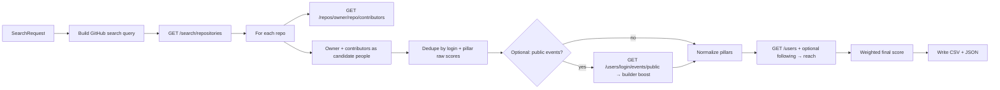

# GitHub Sourcing Tool

A small, self-hosted web app for **venture and talent sourcing on GitHub**. You describe a space (topics, keywords, languages), it searches **repositories**, pulls **top contributors** plus **owners**, **deduplicates people**, scores and ranks them using three pillars—**Builder**, **Product**, and **Reach**—and exports a **CSV** you can use in your own CRM, spreadsheet, or research workflow.

This project is **not affiliated with GitHub**. It uses the [GitHub REST API](https://docs.github.com/en/rest) only. You are responsible for complying with [GitHub’s Terms of Service](https://docs.github.com/en/site-policy/github-terms/github-terms-of-service) and applicable privacy laws when you collect or contact people.

---

## Table of contents

- [What it does](#what-it-does)
- [How it works](#how-it-works)
- [Requirements](#requirements)
- [Installation](#installation)
- [Configuration](#configuration)
- [Running the app](#running-the-app)
- [Using the web UI](#using-the-web-ui)
- [HTTP API](#http-api)
- [Migrating older API clients](#migrating-older-api-clients)
- [Output files and CSV columns](#output-files-and-csv-columns)
- [GitHub API usage and rate limits](#github-api-usage-and-rate-limits)
- [Troubleshooting](#troubleshooting)
- [Project layout](#project-layout)
- [Contributing](#contributing)
- [License](#license)

---

## What it does

| Capability | Description |
|------------|-------------|
| **Repository search** | Builds a GitHub search query from your topics, optional keywords, language, license, star range, repo age, and last-push window. |
| **People discovery** | For each matching repo, collects the **owner** and up to **N** top **contributors** (public API). |
| **Deduplication** | Merges rows by GitHub `login`, keeping the strongest per-pillar raw signals and a short list of matched repos. |
| **Scoring** | **Three pillars** with per-run weights: **Builder** (recency, damped contributions, optional public events), **Product** (README, CI/workflows, repo metadata), **Reach** (followers + optional overlap with a **KOL** login list via following). |
| **Export** | Writes **CSV** and **JSON** under `data/jobs/` and offers download links in the UI. |

**What it does not do:** It does not scrape the GitHub website, access private repositories without permission, send email, or integrate with a specific CRM. Those are left to you.

---

## How it works

At a high level, each run is a **background job**:



### Intuition for investors and operators

1. **Repositories are the funnel.** GitHub search finds *artifacts* (codebases) that match your thesis: topics like `fintech`, keywords like `"embedded" AND "payments"`, language filters, etc.

2. **Contributors proxy “who is building.”** The API does not have a perfect “founder” label. In practice, **owners** and **frequent contributors** are reasonable starting points for outbound or deeper research. Always verify identity and role elsewhere (LinkedIn, company site, etc.).

3. **Defaults skew away from “obvious mega-OSS.”** Sorting by **stars ascending** and capping **max stars** (default 800) reduces dominance of household-name libraries. You can relax those settings when you want broader coverage.

4. **Three pillars (you set the weights each run).**  
   - **Builder:** repo recency, contributor volume (intentionally damped so raw commit count does not dominate), optional public-event boost.  
   - **Product:** from search metadata (description, homepage, topics, license, …) and, if enabled, **README** + **`.github/workflows`** (extra API calls per repo).  
   - **Reach:** **followers** plus optional **KOL list** — overlap between who the user **follows** (first API page only) and logins you label as KOLs.

5. **Optional “field momentum”** (public events) feeds the **builder** pillar before normalization.

6. **Final `score`** is `w_b × builder_norm + w_p × product_norm + w_r × reach_norm` after per-run min–max normalization within the candidate set. **`score` is a ranking aid, not ground truth.**

---

## Requirements

- **Python 3.8+** (tested with 3.8; newer versions are fine)
- A **GitHub account** and a **Personal Access Token** (see below)
- Network access to `api.github.com`

---

## Installation

Clone or copy this repository, then:

```bash
cd github-sourcing-tool
python3 -m venv .venv
source .venv/bin/activate   # Windows: .venv\Scripts\activate
pip install -r requirements.txt
```

---

## Configuration

### 1. Create `.env`

```bash
cp .env.example .env
```

### 2. Add your token

Edit `.env`:

```env
GITHUB_TOKEN=ghp_xxxxxxxxxxxx
```

**Never commit `.env`.** It is listed in `.gitignore`.

### Token type and permissions

- **Classic PAT:** For public data only, you can use a token with **no scopes** (or minimal read scopes). That still improves rate limits versus unauthenticated use.
- **Fine-grained PAT:** Prefer the smallest access that works for your use case. This app’s calls are public REST endpoints (including `/search/repositories`, `/repos/.../contributors`, `/repos/.../readme`, `/users/...`, `/users/.../following`, `/users/.../events/public`). Configure **read-only** access to **public** repositories as appropriate in the GitHub UI.

If GitHub returns `401` or `403` on some routes, regenerate the token or adjust permissions.

---

## Running the app

```bash
source .venv/bin/activate
uvicorn app.main:app --host 127.0.0.1 --port 8000 --reload
```

Open **http://127.0.0.1:8000** in your browser.

- **Interactive API schema:** **http://127.0.0.1:8000/docs** (Swagger UI generated from FastAPI).
- **`--reload`** restarts the server when code changes (development only).
- If you see **“Address already in use”**, another process is bound to port 8000. Stop it or use another port, e.g. `--port 8001`.

---

## Using the web UI

The page is organized into **Search**, **Filters**, **Scoring**, **Activity**, a collapsible **Limits & API usage** block, and a **Status** area (progress, messages, CSV download). A short **How this run works** strip at the top summarizes the three pillars.

### Search and filters

| Field | What it does |
|-------|----------------|
| **Topics** | Comma-separated labels; each becomes `topic:<name>` in the query (OR-combined). |
| **Free keywords** | Inserted into the query as you type them—useful for phrases and GitHub search operators (`AND`, `OR`, quotes). |
| **Language / License** | Standard GitHub qualifiers: `language:Python`, `license:MIT`. |
| **Min / Max stars** | Star range. Default **max 800** reduces huge mainstream projects. Clear **Max stars** to remove the cap (send `null` via API). |
| **Repo created within** | Adds `created:>=YYYY-MM-DD` (repos first created in the last *N* days). |
| **Repo pushed within** | Adds `pushed:>=YYYY-MM-DD` (repos with a push in the last *N* days)—good for “actively maintained.” |
| **Repo search order** | `stars_asc` (default) lists low-star repos first; `updated_desc` favors recently touched repos; `best_match` uses GitHub’s default relevance sort. |
| **Exclude org-owned repos** | Skips repositories whose owner `type` is `Organization` (many large OSS foundations). |
| **Down-rank mega-star repos** | Multiplies the **builder** signal by an obscurity factor so very high-star repos contribute less to a person’s rank. |
| **Recency window (days)** | Under **Limits & API usage**: controls how strongly **repository `updated_at`** affects the **builder** pillar (exponential decay). |

### Scoring, KOLs, and deep product

These map directly to `SearchRequest` JSON fields (see [HTTP API](#http-api)).

| Field | What it does |
|-------|----------------|
| **Builder / Product / Reach weights** | Positive numbers; the app **normalizes** them to sum to 1 each run (`weight_builder`, `weight_product`, `weight_reach`). |
| **Commit weight in builder (0–1)** | Inside the builder blend: how much **contributor count** matters vs **repo recency** (`builder_contribution_weight`). |
| **Fetch README + GitHub Actions per repo** | Extra API calls per repo; strengthens the **product** pillar only (`deep_product_signals`). |
| **KOL GitHub usernames** | Optional list; overlap with the user’s **following** (first API page) mixes into **reach** (`kol_github_logins`). |
| **People to fetch for reach** | Only the first *N* people (by builder+product pre-rank) get `/users` and optional `/following` (`max_people_reach_lookup`). |
| **KOL vs followers (0–1)** | When KOLs are set, how much **reach** comes from KOL overlap vs follower count (`kol_share_of_reach`). |

### Limits and cost control

| Field | What it does |
|-------|----------------|
| **Max repos to process** | Caps how many search results you walk (each may trigger a contributors request). |
| **Contributors per repo** | Max contributor rows fetched per repository (plus owner). |
| **Max unique people** | Stops the run early once this many distinct logins are collected. |

### Optional: field activity (extra API calls)

| Field | What it does |
|-------|----------------|
| **Boost people with recent public activity** | For the top *N* candidates (by builder+product pre-rank), fetches **public events** and adds a weighted bonus to the **builder** pillar before normalization. |
| **Activity window (days)** | How far back to count events. |
| **Max people to enrich** | Caps how many users get an events request (each call uses the **core** rate limit). |
| **Activity boost / unit** | Multiplier for the weighted activity sum before it is folded into the raw builder signal. |

---

## HTTP API

Base URL: `http://127.0.0.1:8000` (or your host/port).

### `POST /api/search/run`

Body: JSON matching **`SearchRequest`** (see table below). Returns a **`JobStatus`** object including `job_id`.

Example:

```bash
curl -s -X POST http://127.0.0.1:8000/api/search/run \
  -H "Content-Type: application/json" \
  -d '{
    "topics": ["devtools"],
    "max_stars": 500,
    "repo_count": 50,
    "contributors_per_repo": 10,
    "enrich_field_activity": false
  }'
```

### `GET /api/search/status/{job_id}`

Returns job state: `queued` | `running` | `done` | `error`, `progress` (0–1), `message`, and `output_csv_path` when finished.

### `GET /api/search/result_csv/{job_id}`

Downloads the CSV when the job is **done**.

### `GET /api/search/result_json/{job_id}`

Returns the same rows as JSON (after the job writes `data/jobs/{job_id}.json`).

### `SearchRequest` (JSON fields)

| Field | Type | Default (if omitted) | Notes |
|-------|------|----------------------|--------|
| `topics` | string[] | `[]` | Mapped to `topic:` qualifiers. |
| `free_keywords` | string | `""` | Raw query fragment. |
| `language` | string \| null | null | e.g. `Python`. |
| `license` | string \| null | null | e.g. `MIT`. |
| `min_stars` | int \| null | null | |
| `max_stars` | int \| null | `800` | Set `null` to disable cap. |
| `repo_created_within_days` | int \| null | null | |
| `repo_pushed_within_days` | int \| null | null | |
| `exclude_org_owned` | bool | false | |
| `early_stage_scoring` | bool | true | Obscurity multiplier on the **builder** signal from very high-star repos. |
| `repo_search_sort` | string | `stars_asc` | `best_match`, `updated_desc`, `stars_asc`, `stars_desc`. |
| `recency_days` | int | 180 | Repo update recency decay. |
| `enrich_field_activity` | bool | false | |
| `activity_window_days` | int | 21 | 1–90. |
| `max_people_activity_enrichment` | int | 80 | 1–400. |
| `activity_boost_per_unit` | float | 12.0 | ≥ 0; feeds **builder** pillar before normalization. |
| `weight_builder` | float | 1.0 | ≥ 0; normalized with other weights to sum to 1. |
| `weight_product` | float | 1.0 | ≥ 0; see `weight_builder`. |
| `weight_reach` | float | 1.0 | ≥ 0; see `weight_builder`. |
| `builder_contribution_weight` | float | 0.22 | 0–1; how much commit volume matters inside **builder** (lower = less pure-contributor bias). |
| `kol_github_logins` | string[] | `[]` | KOL logins; overlap with user **following** (first page) boosts **reach**. |
| `deep_product_signals` | bool | false | If true: `GET /repos/.../readme` + `.../contents/.github/workflows` per repo. |
| `max_people_reach_lookup` | int | 200 | 1–800; how many candidates get `/users` (+ optional `/following`). |
| `kol_share_of_reach` | float | 0.45 | 0–1; when KOL list non-empty, KOL overlap vs followers inside **reach**. |
| `repo_count` | int | 200 | |
| `contributors_per_repo` | int | 20 | |
| `dedup_people_by_login` | bool | true | |
| `max_unique_people` | int | 800 | |

### Migrating older API clients

If you integrated before the pillar rename, update JSON bodies and parsed CSV columns:

| Old | New |
|-----|-----|
| `weight_tech` | `weight_builder` |
| `weight_influence` | `weight_reach` |
| `tech_contribution_weight` | `builder_contribution_weight` |
| `max_people_influence_lookup` | `max_people_reach_lookup` |
| `kol_share_of_influence` | `kol_share_of_reach` |
| CSV / JSON `pillar_tech` | `pillar_builder` |
| CSV / JSON `pillar_influence` | `pillar_reach` |

---

## Output files and CSV columns

Each successful run writes:

- **CSV:** `data/jobs/{job_id}.{unix_timestamp}.csv`
- **JSON:** `data/jobs/{job_id}.json`

### CSV columns

| Column | Meaning |
|--------|---------|
| `login` | GitHub username. |
| `profile_url` | `https://github.com/{login}` (or API-provided profile URL). |
| `latest_repo_updated_at` | ISO timestamp of the repo `updated_at` tied to the person’s strongest **builder** signal (approximation). |
| `score` | Weighted blend of the three pillars after **per-run normalization** within the candidate set. |
| `pillar_builder` | Normalized **builder** subscore (0–1 within this run’s export). |
| `pillar_product` | Normalized **product** subscore (0–1). |
| `pillar_reach` | Normalized **reach** subscore (0–1). |
| `matched_repos` | Semicolon-separated list of `owner/repo` strings (truncated in export to a short list). |
| `total_contributions_in_sample` | Sum of contributor counts seen across matched repos in this run (not total GitHub-wide contributions). |
| `top_signal_repo_stars` | Stargazer count of the repo that drove the strongest **builder** signal for that person. |
| `field_activity_weighted` | Weighted sum of recent **public** events if enrichment ran; otherwise `0`. |

---

## GitHub API usage and rate limits

### Rough call count per run (before activity enrichment)

- **Search:** about `ceil(repo_count / 100)` requests to `/search/repositories`.
- **Contributors:** up to **one request per processed repo** (fewer if the run stops early or a request fails).

So a worst-case order of magnitude is **search pages + repo_count**. Example: `repo_count=200` → about **2 + 200 = 202** requests.

### Activity enrichment

If enabled, add up to **`max_people_activity_enrichment`** calls to `/users/{login}/events/public` (plus pagination, up to 2 pages per user in code).

### Deep product signals

If `deep_product_signals` is true, add up to **2 × repo_count** calls (README + workflows directory per repo), modulo caching within a run.

### Reach

Up to **`max_people_reach_lookup`** calls to `GET /users/{login}`, plus up to one **`GET /users/{login}/following`** per candidate when `kol_github_logins` is non-empty.

### Rate limits

GitHub applies **separate limits** (e.g. **search** vs **core**). The app checks response headers and stops with a clear message when limits are almost exhausted. Search limits are **much lower per minute** than core limits—large runs can hit search first.

The HTTP client sets `trust_env = false` on `requests` sessions so **local proxy environment variables** do not accidentally tunnel API traffic (a common cause of `ProxyError` / `403` to `api.github.com`).

---

## Troubleshooting

| Symptom | Things to try |
|---------|----------------|
| **Address already in use** | Stop the old `uvicorn` (Ctrl+C) or use `--port 8001`. Find the PID: `lsof -nP -iTCP:8000 -sTCP:LISTEN`. |
| **Missing `GITHUB_TOKEN`** | Ensure `.env` exists next to `requirements.txt` and contains `GITHUB_TOKEN=...`. Restart the server. |
| **Rate limit errors** | Wait for reset (message includes approximate time), reduce `repo_count` / `max_people_activity_enrichment`, or run during off-peak. |
| **Proxy / tunnel errors** | Ensure no broken `HTTP_PROXY` / `HTTPS_PROXY` is required for direct access; the app ignores proxy env vars for GitHub calls by design. |
| **Empty or tiny results** | Relax `max_stars`, widen topics/keywords, disable **Exclude org-owned**, or switch **Repo search order** to `best_match` or `updated_desc`. |
| **LibreSSL / urllib3 warning** | On some macOS Python builds you may see `NotOpenSSLWarning`; it is usually harmless for this app. |

---

## Project layout

```
github-sourcing-tool/
├── app/
│   ├── main.py           # FastAPI app and routes
│   ├── models.py         # Pydantic request/response models
│   ├── jobs.py           # Job runner, query builder, pipeline
│   ├── github_client.py  # Thin GitHub REST wrapper + rate-limit guard
│   ├── scoring.py        # Recency and obscurity helpers
│   ├── pillars.py        # Builder / product / reach subscores
│   ├── activity.py       # Public-event weighting for enrichment
│   ├── export_csv.py     # CSV writer
│   └── templates/
│       └── index.html    # Web UI
├── data/jobs/            # Generated CSV/JSON (gitignored)
├── requirements.txt
├── .env.example
└── README.md
```

---

## Contributing

Issues and pull requests are welcome. When contributing:

- Keep changes focused and documented.
- Do not commit secrets (`.env`, tokens).
- Match existing style and typing.

If you add features that change behavior, update this **README** and, if applicable, the **UI** labels so newcomers stay unblocked.

---

## License

This project is licensed under the MIT License - see the LICENSE file for details.
